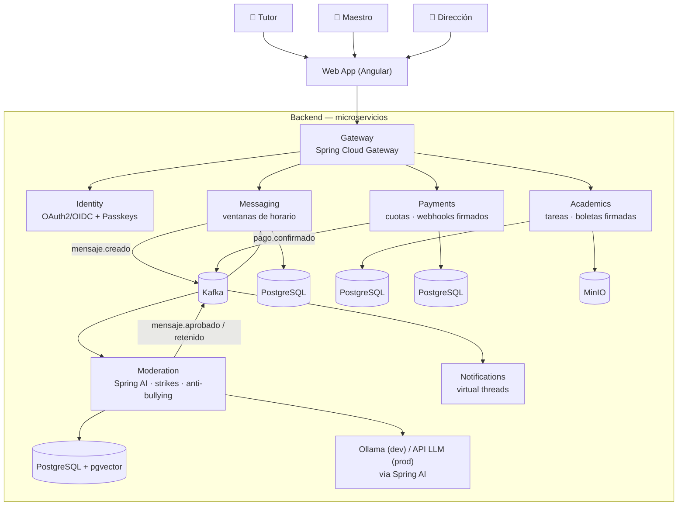

# Sistema Escolar 🏫

> Plataforma de comunicación escuela-familia donde los maestros **nunca exponen sus datos
> personales**, los mensajes **respetan horarios laborales**, y una capa de **IA modera el
> trato** — con gestión académica y pagos de cuotas integrados.

**Estado:** 🚧 En desarrollo — Fase 0 (cimientos)

## El problema

En primarias y secundarias de México la comunicación maestro-padres pasa por el WhatsApp
personal del maestro: mensajes a cualquier hora, sin registro, y a veces con malos tratos.
Este sistema lo resuelve:

- El maestro se comunica desde la plataforma; su teléfono nunca se comparte.
- Mensajes fuera del horario laboral se encolan y se entregan el siguiente día hábil.
- Cada mensaje pasa por moderación con IA **antes** de entregarse: los mensajes ofensivos
  se retienen y generan strikes graduales (aviso → mute temporal → escalamiento a dirección).
  El maestro nunca ve la grosería. *La IA marca, el humano decide.*
- Buzón anónimo de reportes de bullying con triage automático hacia orientación.
- Tareas, calificaciones y boletas PDF firmadas digitalmente; pagos de cuotas con
  webhooks firmados e idempotencia.

## Arquitectura



Diagramas completos (C4 contexto y contenedores) en [`docs/diagrams/`](docs/diagrams/).

## Servicios

| Servicio | Responsabilidad |
|---|---|
| `gateway` | Routing, rate limiting, versionado de API (`@ApiVersion` de Spring Boot 4) |
| `identity` | Spring Authorization Server: OAuth2/OIDC propio + login con passkeys (WebAuthn) |
| `messaging` | Conversaciones tutor↔maestro con ventanas de horario y cola de fuera-de-horario |
| `moderation` | Clasificación de mensajes con Spring AI, sistema de strikes, buzón anti-bullying |
| `academics` | Tareas, calificaciones, boletas PDF firmadas (JWS) |
| `payments` | Cuotas escolares: webhooks firmados, idempotencia, conciliación |
| `notifications` | Notificaciones event-driven con virtual threads de Java 21 |

## Stack

Java 21 · Spring Boot 4 / Framework 7 · Spring Security 7 · Spring AI · Kafka ·
PostgreSQL + pgvector · Redis · MinIO · Testcontainers · Docker Compose · Kubernetes (kustomize) ·
GitHub Actions · Ollama (dev) — frontend en [sistema-escolar-web](../sistema-escolar-web),
configuración en [sistema-escolar-config](../sistema-escolar-config).

## Cómo correr (infra local)

```bash
cd infra
docker compose up -d
```

Levanta PostgreSQL (con pgvector), Kafka, Redis, MinIO y Ollama. Los servicios se agregan
a partir de la Fase 1.

## Estructura

```
CONTRIBUTING.md    → convenciones del proyecto
docs/specs/        → una spec por feature (se escribe ANTES de codear)
docs/adr/          → decisiones de arquitectura
docs/diagrams/     → diagramas C4 (Mermaid)
contracts/openapi/ → contratos REST (contract-first)
contracts/events/  → esquemas de eventos Kafka
services/          → microservicios
infra/             → docker-compose y manifests de K8s
```

## Roadmap

- [x] **Fase 0** — cimientos: convenciones, infra local, contratos, diagramas, CI
- [ ] **Fase 1** — identity (passkeys) + gateway
- [ ] **Fase 2** — messaging + moderation (el corazón del sistema)
- [ ] **Fase 3** — academics: tareas y boletas firmadas
- [ ] **Fase 4** — payments + notifications
- [ ] **Fase 5** — RAG del reglamento, servidor MCP, observabilidad, K8s
