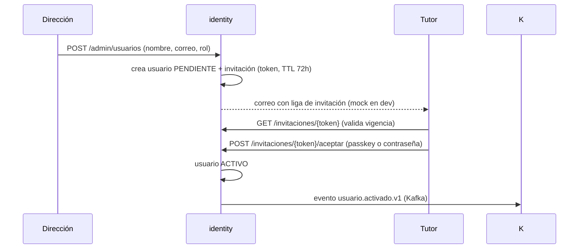

# SPEC-001: Servicio de identidad (identity)

**Servicio(s):** identity
**Estado:** aprobada
**Rama:** feat/001-identity

## Problema

El sistema necesita saber quién es cada usuario y qué puede hacer. Hay cuatro tipos de
usuario con permisos muy distintos (dirección, maestro, tutor, alumno) y un requisito de
dominio fuerte: **las cuentas las controla la escuela**, no hay auto-registro — un tutor
no puede crearse una cuenta solo, la dirección lo da de alta y lo vincula con sus hijos.
Además, el login debe ser simple para usuarios no técnicos (padres) sin sacrificar
seguridad.

## Solución propuesta

Un servicio `identity` basado en **Spring Authorization Server** (OAuth2/OIDC propio):

1. **Alta por invitación (sin auto-registro).** Dirección registra maestros y tutores con
   nombre y correo. El sistema genera una invitación con token de un solo uso (TTL 72 h)
   y la envía por correo (mock en dev). Al aceptarla, el usuario define su credencial.
2. **Login con passkeys (WebAuthn) como método principal** y contraseña como respaldo.
   El enrolamiento de passkey se ofrece al aceptar la invitación y puede gestionarse
   después (agregar/revocar dispositivos).
3. **Emisión de tokens**: Authorization Code + PKCE para la SPA de Angular. Los access
   tokens (JWT) llevan `role` y `schoolId` como claims. TTLs: access 15 min, refresh 8 h
   con rotación; la reutilización de un refresh token rotado revoca toda la familia de
   tokens (detección de robo).
4. **Roles**: `DIRECCION`, `MAESTRO`, `TUTOR`, `ALUMNO` (alumno queda modelado desde ahora,
   pero su login se activa en fase posterior).
5. **Alcance MVP**: una sola escuela (`schoolId` fijo). El modelo lo lleva desde ahora para
   permitir multi-escuela después sin migración dolorosa.

## Contrato

Actualizar `contracts/openapi/identity.yaml` con:

| Método | Ruta | Quién | Descripción |
|---|---|---|---|
| POST | `/admin/usuarios` | DIRECCION | Alta de usuario (genera invitación). 201 / 409 si el correo ya existe |
| GET | `/admin/usuarios` | DIRECCION | Lista paginada con filtro por rol y estado |
| DELETE | `/admin/usuarios/{id}` | DIRECCION | Baja lógica (estado SUSPENDIDO) |
| POST | `/admin/usuarios/{id}/reinvitar` | DIRECCION | Regenera invitación expirada |
| GET | `/invitaciones/{token}` | público | Valida invitación. 200 / 404 / 410 si expiró |
| POST | `/invitaciones/{token}/aceptar` | público | Activa la cuenta registrando passkey o contraseña |
| GET | `/me` | autenticado | Perfil propio: nombre, rol, vínculos (hijos si es tutor) |
| POST | `/me/passkeys` · DELETE `/me/passkeys/{id}` | autenticado | Gestión de passkeys propios |

Los endpoints estándar OIDC (`/oauth2/authorize`, `/oauth2/token`, `/.well-known/...`,
flujo WebAuthn) los provee Spring Authorization Server / Spring Security y no se
redocumentan aquí.

Eventos (crear en `contracts/events/`):
- `usuario.activado.v1` — payload: userId, schoolId, rol, nombre. Lo consumirá messaging
  para armar sus directorios de conversación sin llamar a identity en línea.
- `usuario.suspendido.v1` — payload: userId, motivo.

## Casos borde

- Invitación expirada → 410 con acción `reinvitar` disponible para dirección.
- Token de invitación usado dos veces → 410 (un solo uso, sin excepciones).
- Correo duplicado en alta → 409; no se revela si el correo existe en respuestas públicas.
- Tutor pierde su passkey y no puso contraseña → dirección lo re-invita (mismo flujo);
  las passkeys anteriores se revocan al aceptar la nueva invitación.
- Fuerza bruta en login → rate limiting por IP y por cuenta (Redis): 5 intentos/min,
  bloqueo progresivo (1, 5, 15 min). Las contraseñas se almacenan con Argon2id.
- Kafka caído al activar usuario → la activación NO se revierte (el evento se guarda en
  outbox y se publica al recuperarse; patrón transactional outbox).

## Criterios de aceptación

- [ ] Dirección da de alta un tutor; el tutor recibe (en logs/mock) su invitación y activa
      su cuenta con passkey; puede hacer login OIDC y `GET /me` regresa su rol y vínculos.
- [x] Una invitación expirada o ya usada regresa 410 y puede regenerarse.
- [ ] Un access token emitido incluye claims `role` y `schoolId` verificables por otro servicio.
- [ ] Un usuario SUSPENDIDO no puede autenticarse ni refrescar tokens.
- [x] Al activar un usuario se publica `usuario.activado.v1` (verificado con Testcontainers + Kafka).
- [ ] Tests de integración: alta→invitación→activación→login (flujo completo) en verde en CI.

## Fuera de alcance

- Multi-escuela real (solo el campo `schoolId` queda sembrado).
- Login de alumnos, recuperación autoservicio de cuenta, verificación de correo real
  (el proveedor de correo llega con notifications en Fase 4).
- Federación con Google/Microsoft (posible ADR futuro).
